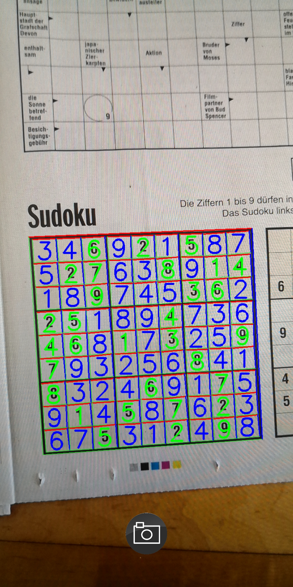

# Sudoku solver

The repository contains code for a sudoku solving application for Android. The sudoku is detected in
the live camera feed and solved. The solution is then superimposed over the image, giving an AR-like
look.

Further, the repository contains the prototypical implementation of the algorithms in python.

The sudoku detection uses standard OpenCV functions to find the sudoku outline and cells. Each cell
is classified with a small CNN. The sudoku solver uses a _Dancing Links_ implementation.

__Disclaimer:__

_The project is only a proof of concept and in no way production ready._

_The digit classification network performance is very bad because it was trained on a very small dataset with only a
small number of different fonts. Therefore, often no solution is available because the digit classification introduced
some errors that make the sudoku unsolvable._

_The Android application is very un-optimized and performs the processing on the main thread. This
leads to lagging UI updated etc. Further, it does not correctly query the sensor orientation, thus
the image preview has the wrong orientation on some phones._

_The desktop app lacks a useful CLI or GUI interface._

## Usage

It is not possible to use this project without some own work. The dataset for test cases and training is not included
due to copyright issues. Therefore, it is necessary to build a new digit dataset from scratch to train the digit
classifier. The digit classifier can be trained with the python code in `sudokupy/classifier/classifier.py`.

There are two variants, an Android app and a desktop program. The Android app uses the device camera
as input and continuously scans for sudokus. If one is detected, the solution is superimposed on the
image. The desktop app is mostly for testing at the moment and uses a file with a list of sudokus as
input.

To build the Android version it is necessary to install the OpenCV4 Android build and set the path in
`gradle.properties`. The desktop version requires a normal install of OpenCV4 and uses standard
mechanics of CMake to detect the library.

## Benchmark results

CPU: Intel Core i7-6700, RAM: 3000MHz CL14

Sudoku detection average: `23.8ms`
Sudoku solving average (various difficulty levels): `0.3ms`.

At the moment there are no safeguards to limit the worst-case time. It can be significantly higher than the average.
